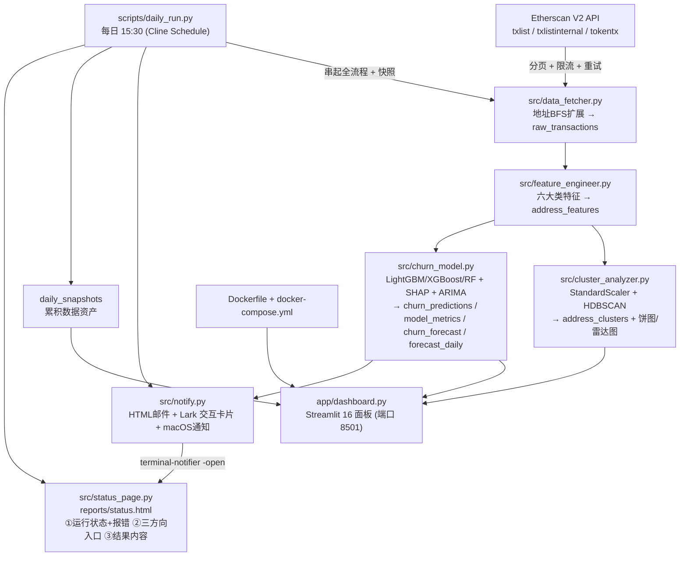

# 🪙 加密货币用户行为聚类分析与流失预测
### Crypto User Behaviour Clustering & Churn Prediction

[中文](README.md) | [English](README_en.md)

一个**批量离线**的链上用户行为分析系统：从 Etherscan 拉取以太坊地址近 6 个月的交易，
做特征工程 → HDBSCAN 聚类画像 → LightGBM/XGBoost/RandomForest 流失预测 + SHAP 可解释性 +
ARIMA 多时间窗频次预测 → Streamlit 16 面板看板，并支持**定时任务**与**邮件/Lark 预警**。

每次运行都会产出四个「看得见结果」的出口，且**都包含同一套内容**：
**运行状态 + 报错内容 · 风险等级（是否高危）· 多时间窗流失率 · 聚类结果 · 业务洞察 · 初步推进建议**。

- **数据源**：Etherscan API V2（普通 / 内部 / ERC-20 三类交易）
- **存储**：SQLite（`data/crypto_churn[_test].db`）
- **聚类**：HDBSCAN（识别变密度簇 + 噪音点）
- **分类**：LightGBM（主）/ XGBoost / RandomForest 三者对比
- **可解释性**：SHAP（全局 + 单样本）
- **时间序列**：ARIMA，**一次拟合同时输出未来 1 / 7 / 14 / 30 / 90 天**频次与流失率
- **可视化**：Streamlit + Plotly（16 panels）
- **推送**：HTML 邮件 · **Lark 交互卡片（真加粗 + 彩色标题）** · macOS 通知（**点击直达运行状态页**）
- **运行状态页**：`reports/status.html`（三方向入口 + 结果内容 + 报错详情，本地双击即可看）
- **交付**：Docker 单镜像，`docker compose up` 一键跑全流程并开看板

> ⚠️ **关于样本量（重要）**：过去 24h 的活跃节点约 **12000** 个，**本机跑不动**
> （免费 Etherscan Key 限流约 5 请求/秒，2000 个地址即需数小时）。因此本项目**默认只取 2000 个
> 地址做「链路可行性验证」**：证明 抓取 → 特征 → 聚类 → 三模型预测 → ARIMA 多窗口 →
> 邮件/Lark/看板 三通道端到端能跑通。公司内部 Etherscan API（或自建归档节点）就绪后，
> 把 `ADDRESS_LIMIT` 调到 `12000`、放宽 `MONTHS_BACK` 即可在**同一套代码**上跑全量。


---

## 🏗️ 架构图 (Mermaid)



**执行顺序**：`data_fetcher` → `feature_engineer` → `cluster_analyzer` → `churn_model` →
`streamlit run app/dashboard.py` → 浏览器打开 `http://localhost:8501`。

---

## 🧰 技术栈

`requests` · `pandas` · `numpy` · `scikit-learn` · `hdbscan` · `lightgbm` · `xgboost` ·
`shap` · `statsmodels`(ARIMA) · `plotly` · `streamlit` · `python-dotenv`

---

## 📁 目录结构

```
crypto_churn_prediction_project/
├── src/
│   ├── config.py            # 集中配置 + 测试模式后缀逻辑
│   ├── db.py                # SQLite schema + 连接
│   ├── data_fetcher.py      # ① 抓取
│   ├── feature_engineer.py  # ② 特征
│   ├── cluster_analyzer.py  # ③ 聚类
│   ├── churn_model.py       # ④ 流失预测 + SHAP + ARIMA（1/7/14/30/90 天多窗口）
│   ├── notify.py            # 邮件 / Lark 卡片 / macOS 告警 + 简报/建议生成
│   └── status_page.py       # 运行状态页 reports/status.html（通知点击直达）
├── app/dashboard.py         # ⑤ Streamlit 16 面板
├── scripts/
│   ├── run_pipeline.py      # 一键串起 ①→④
│   └── daily_run.py         # 每日 15:30 调度 + 快照 + 告警 + 状态页
├── templates/alert_email.html  # 预警邮件 HTML（{{占位符}}）
├── reports/                 # 产物：图表 / HTML 日报 / status.html / email_preview.html / lark_card.json
├── docs/
│   ├── development-log.md   # 技术决策 + 踩坑
│   └── insights.md          # 业务洞察（自动生成）
├── tests/test_pipeline.py   # 单元测试（无网络）
├── Dockerfile / docker-compose.yml / docker-entrypoint.sh / start.sh
├── environment.env.example / requirements.txt
└── README.md
```

---

## 🚀 本地部署和运行（三种方式）

### 方式 A：直接拉取镜像（最省事，不想 build）

```bash
# 拉取已构建好的镜像
docker pull bonnie333333333/crypto-churn-prediction:latest

# 一键跑全流程并启动看板（挂载宿主 ./data 持久化数据库）
docker run -d --name crypto-churn-app -p 8501:8501 \
  -e ETHERSCAN_API_KEY=你的Key \
  -e ADDRESS_LIMIT=200 \
  -v "$PWD/data:/app/data:rw" \
  bonnie333333333/crypto-churn-prediction:latest

# 打开 http://localhost:8501
```

### 方式 B：`docker compose up` 一句命令拉起（推荐，自动跑脚本 + 自动开网页）

```bash
# 1) 准备环境变量
cp environment.env.example environment.env
#    编辑 environment.env：填入 ETHERSCAN_API_KEY（可选 ADDRESS_LIMIT / 邮件 / Lark）

# 2) 一键：构建镜像 -> 首启自动跑完整流水线 -> 启动看板 -> 自动打开浏览器
./start.sh
#    等价于： docker compose up -d --build  然后  open http://localhost:8501
```

`docker-entrypoint.sh` 会在**首次启动**时自动按顺序执行：
`data_fetcher → feature_engineer → cluster_analyzer → churn_model → streamlit run app/dashboard.py`，
跑完整合到容器内数据库。之后重启会直接启动看板（用 marker 判断，`FORCE_PIPELINE=1` 可强制重跑）。

> 浏览器：打开 <http://localhost:8501> 即直接看到看板（Streamlit 无需登录）。

### 方式 C：手动一步步依次跑脚本（本地 conda，便于调试）

```bash
# 0) 激活环境 + 安装依赖
conda activate crypto_churn_prediction_project      # Python 3.11
# 没有就先： conda create -n crypto_churn_prediction_project python=3.11 -y
pip install -r requirements.txt

# 1) 配置密钥
cp environment.env.example environment.env           # 填入 ETHERSCAN_API_KEY

# 2) 按顺序执行（测试用 ADDRESS_LIMIT=200，产物带 _test 后缀；本机验证规模 2000）
python src/data_fetcher.py           # 抓取 → raw_transactions
python src/feature_engineer.py       # 特征 → address_features
python src/cluster_analyzer.py       # 聚类 → address_clusters + 图表
python src/churn_model.py            # 预测 → churn_predictions / model_metrics / churn_forecast
streamlit run app/dashboard.py       # 看板 → http://localhost:8501
```

也可以用一键脚本（等价于上面 ①→④）：

```bash
python scripts/run_pipeline.py          # 全流程（含抓取）
python scripts/run_pipeline.py --skip-fetch   # 复用已有原始数据
python scripts/daily_run.py --dry-run   # 模拟每日任务（不联网抓取）
```

> **测试模式说明**：`ADDRESS_LIMIT<=200` 时判定为测试模式，所有产物文件名自动加 `_test`
> 后缀（如 `data/crypto_churn_test.db`、`reports/cluster_pie_test.png`），避免污染全量数据集。
> 本机验证规模为 `2000`（免费 Etherscan Key 限流下约需数小时）；**全量约 12000 个节点**
> 需公司内部 Etherscan API / 归档节点，把 `ADDRESS_LIMIT` 改为 `12000` 即可。

---

## 🔍 各阶段说明

### ① 数据抓取 `src/data_fetcher.py`
从 10 个种子地址出发，**BFS 扩展交易对手方**直到凑够 `ADDRESS_LIMIT` 个地址；对每个地址拉取
普通/内部/ERC-20 三类交易，`INSERT OR IGNORE` 幂等入库，分页 + 限流 + 指数退避重试。

### ② 特征工程 `src/feature_engineer.py`（六大类特征）
交易频次（日/周/月）、平均持仓时长（收到→转出，FIFO 配对）、Gas 消耗模式（高 Gas 占比/均价）、
协议多样性（交互合约数）、代币行为（不同代币数/占比）、资产规模变化（ETH 余额趋势斜率）。

### ③ 聚类 `src/cluster_analyzer.py`
`StandardScaler` 标准化 → **HDBSCAN** 聚类 → 按质心自动打 persona 标签
（**高频大户 / 长期持有者 / DeFi农民 / 高频套利者**，噪音点单独标记）→ 输出簇分布饼图、
簇画像雷达图、t-SNE 坐标。

> **为何用 HDBSCAN 而非 K-Means**：链上数据密度极不均匀（少数超级大户 + 长尾静止地址），
> K-Means 假设球形等方差且强制每个点归簇；HDBSCAN 能识别变密度簇并把"机器人/一次性地址"
> 判为**噪音点**，簇更紧凑、可解释性更强。

### ④ 流失预测 `src/churn_model.py`
- **标签**：`last_tx_days_ago > 30` 记流失。
- **三模型对比**：LightGBM（主）/ XGBoost / RandomForest，输出 AUC / F1 / Precision / Recall，
  并在洞察中对比"三种针对离散标签的建模方式谁更科学"。
- **SHAP**：全局特征重要性 + **单样本解释**（如"协议多样性从 5 降到 1 → 流失概率上升 40%"）。
- **频次 × 流失率相关性**：按 `tx_freq_daily` 分桶统计真实流失率，定位**危险频次区间**。
- **ARIMA 预测（多时间窗）**：对每个地址的日交易笔数序列拟合一次 `ARIMA(1,1,1)`，**拟合到最大窗口**
  （默认 90 天），再**一次性输出 1 / 7 / 14 / 30 / 90 天**每个窗口的：平均日频次、频次降低值、
  平均流失率、末日流失率。这样避免了「每个窗口各拟合一次」的 5 倍算力，并额外得到
  **短窗 vs 长窗对比结论**（短窗流失率 ≥ 长窗 ⇒ 正在「加速出逃」，需立刻干预；
  否则属于「渐进式失活」，仍有挽回窗口）。

### ⑤ 可视化 `app/dashboard.py`（16 panels）
1 核心指标卡 · 2 簇分布饼图 · 3 簇画像雷达图 · 4 t-SNE 散点 · 5 模型指标表 · 6 三模型对比 ·
7 各簇流失率 · 8 流失概率分布 · 9 SHAP 全局 · 10 SHAP 单样本 · 11 频次×流失率 · 12 未来30天预测 ·
13 高危地址 TOP20 · 14 累积数据资产 · 15 管道运行健康 · 16 业务洞察文字区。

---

## ⏰ 每日调度与数据资产化

用 **Cline Schedule** 确保每天 **15:30** 自动运行、持续累积数据资产：

```bash
# 通过 Cline 创建一个每日 15:30 的定时任务（cron: 30 15 * * *）
# 任务内容示例：
cd ~/Desktop/crypto_churn_prediction_project && \
  conda run -n crypto_churn_prediction_project python scripts/daily_run.py
```

或系统 cron：

```bash
# 0 分 15 时（即 15:30... 见下方 30 15）—— 每天 15:30
30 15 * * * cd ~/Desktop/crypto_churn_prediction_project && \
  conda run -n crypto_churn_prediction_project python scripts/daily_run.py >> logs/cron.log 2>&1
```

`scripts/daily_run.py` 每次会：跑全流程 → 写入 `daily_snapshots`（看板第 14 个面板展示日累积曲线）
→ 生成 HTML 报告到 `reports/` → 生成 **运行状态页 `reports/status.html`** 并**自动在浏览器打开** →
**成功或失败都弹 macOS 通知**（`terminal-notifier`，**点击通知直接打开状态页**）→
按阈值决定是否发预警邮件/Lark 卡片 → 把本次运行结果写入 `reports/last_run.json`。

### 📄 运行状态页 `reports/status.html`

一次运行的全部「可交付内容」都收敛到这一页（本地双击即可打开，不依赖服务）：

| 区块 | 内容 |
| --- | --- |
| 顶部 | ✅/❌ 运行状态徽章 + 🟢🟡🟠🔴 风险等级（×阈值倍数）+ 生成时间/耗时/预测窗口 |
| 一、运行状态 + 报错内容 | 每个阶段（① 数据抓取 / ② 特征工程 / ③ 聚类 / ④ 流失预测）的 ok/fail/detail/时间；失败时给出**报错原文** |
| 二、三个方向的入口与结果 | 📧 邮件（收件人 + HTML 预览链接）· 💬 Lark（卡片 JSON 原文链接）· 📊 Streamlit 看板（可点链接） |
| 三、结果内容 | 主窗口流失率 · **1/7/14/30/90 天多时间窗流失率（越线标 ⚠️）** · 高危占比 · 频次/降幅 · 样本量 |
| 四、聚类结果 | 每簇规模/实际流失率/日均笔数/持仓/闲置（与 Lark 卡片文字一致） |
| 五、业务洞察 | `docs/insights.md` 全文 |
| 六、初步推进建议 | 模板规则生成的行动 + 责任方（增长/运营、风控、客户成功…） |
| 附 | Lark 推送原文（折叠）+ 样本量说明 |

> **一次性设置（仅 macOS，可选）**：想用「点击通知直接跳转」，需允许 `terminal-notifier` 发通知：
> 系统设置 → 通知 → **Terminal Notifier** → 允许通知。可以直接打开该面板：
> `open "x-apple.systempreferences:com.apple.Notifications-Settings.extension"`。
> 本项目已把 app bundle 真实拷贝到 `~/Applications/Terminal Notifier.app` 并向 LaunchServices
> 注册（`lsregister -f`），否则 macOS 只会报 `Notifications are not allowed for this
> application` 而不会在设置里列出它。若未授权，代码会**自动回退**到 `osascript` 普通横幅
> （并在日志里给出上述开启提示），且状态页仍会被自动打开，功能不丢。

---

## 🔔 预警推送：邮件 + Lark 卡片 + macOS 通知 + 运行状态页

四个出口由 `src/notify.py` + `src/status_page.py` 统一构建、分发，**内容同源、口径一致**：

| 出口 | 推送内容 | 触发条件 |
| --- | --- | --- |
| **邮件** | HTML 卡片（`templates/alert_email.html` 占位符填空）：**运行状态 + 风险等级 + 多时间窗 + 核心指标 + 触发原因 + 推进建议** → `ALERT_EMAIL_TO` | 预测流失率 ≥ 40% 或高危占比 ≥ 25% |
| **Lark / 飞书群机器人** | **交互卡片**（`msg_type: interactive` + `lark_md`）＝ ① **运行状态 + 报错内容** ② **风险等级（🟢🟡🟠🔴 + ×阈值 + 处置建议）** ③ **1/7/14/30/90 天多时间窗流失率（越线标 ⚠️）** ④ 一、流失预警 ⑤ 二、文字描述形式的用户行为聚类结果 ⑥ 三、自动提炼的 insights ⑦ **初步推进建议（含责任方）** ⑧ 看板链接；标题栏颜色随状态/风险变化（失败或🔴高危＝红头） | **每天例行推送**，不受阈值门控；阈值触发时预警段标 ⚠️ |
| **macOS 通知** | `terminal-notifier` 横幅（标题＝✅/❌ + 流失率 + 风险等级），**点按即打开 `reports/status.html`** | 成功与失败都推送 |
| **运行状态页** | `reports/status.html`：①运行状态+报错 ②三方向入口与结果 ③结果内容 ④聚类 ⑤洞察 ⑥建议 | 每次运行都生成并自动打开 |

> **关于「Lark 只能是 plain text 吗」**：不是。群机器人 webhook 支持 `msg_type: "interactive"`
> （消息卡片），卡片内文本用 `lark_md` 方言即可获得**真加粗**、彩色标题栏、分割线、超链接与 @；
> `msg_type: "post"`（富文本）也能加粗但没有彩色标题栏。因此简报用**卡片**发送，同时保留一段
> **纯文本兜底**（卡片发送失败时自动降级，见 `send_lark_digest()`）。

Lark 卡片由 `build_digest_card()` 生成、纯文本由 `build_digest_text()` 生成，实测样例
（`python -m src.notify --preview` 或 `python -m src.notify`）：

```text
📮 加密用户行为聚类 & 流失预测 · 每日简报
2026-10-06 21:45 ｜ 预测时间窗 30 天 ｜ 风险等级 🟠 警戒
————————————
运行状态：✅ 成功（4/4 阶段成功）
完成时间：2026-10-06 21:44 ｜ 耗时 3421 秒
① 数据抓取：ok ｜ 2000 个地址 / 1873921 条交易
② 特征工程：ok ｜ 2000 行特征
③ 聚类：ok ｜ 4 类 + 137 个噪音点
④ 流失预测：ok ｜ 主模型 LightGBM · AUC 0.91

报错内容：无
————————————
🟠 警戒 ｜ 已越过预警线（1.17× 阈值 40%）→ 进入处置流程：高危簇触达 + 召回实验
多时间窗流失率预测（越线标 ⚠️，阈值 40%）
- 1 天：流失率 58.2% ⚠️ ｜ 人均日频 1.42（较当前降 2.21）
- 7 天：流失率 55.1% ⚠️ ｜ 人均日频 1.55（较当前降 2.08）
- 30 天：流失率 51.5% ⚠️ ｜ 人均日频 1.86（较当前降 1.77）
- 90 天：流失率 49.0% ⚠️ ｜ 人均日频 2.05（较当前降 1.58）
- 结论：短窗（1 天）流失率已不低于长窗，说明正在**加速出逃**，需立刻干预。
————————————
一、流失预警（已触发 ⚠️）
预测流失率（30 天）: 51.5%（阈值 40%）
高危流失占比: 67.0%（阈值 25%）　高危行为簇占比: 52.0%
人均日交易频次: 33.8058 → 第 30 天 19.2369（降幅 14.526）
触发原因: 预测 30 天流失率 51.5% ≥ 阈值 40%；高危地址占比 67.0% ≥ 阈值 25%
————————————
二、【用户行为聚类结果】HDBSCAN · 4 类 + 96 个噪音点 · 覆盖 200 个地址
⚠️ 噪音/机器人 · 96 个（48.0%）｜实际流失率 38.5% · 日均 67.10 笔 · …
高频大户 · 55 个（27.5%）｜实际流失率 74.5% · 日均 4.23 笔 · 持仓 8.4h · …
    └ 交易频繁、余额厚，是协议的核心用户
长期持有者 · 31 个（15.5%）｜实际流失率 12.9% · …
    └ 低频但持仓久，粘性最强、流失率最低
————————————
三、业务洞察（从聚类与模型自动提炼）
· 驱动流失的关键特征 (SHAP)
• total_tx: 平均 |SHAP| = 1.1441
· 结论
未来 30 天人均交易频次预计由 33.8058 降至 19.2369 …
————————————
初步推进建议（模板规则生成，非大模型）
- 立刻止血：短窗流失率已高于长窗，属于加速出逃，建议 48h 内上线一轮定向召回（责任方：增长/运营 + 客户成功 ｜ 依据：多时间窗对比）
- 主攻「高频套利者」（55 个 · 占 27.5%）：定向召回 + 费率/返佣实验（责任方：增长 / 运营 ｜ 依据：高频 Gas 占比高、长期闲置，对收益率与费率极敏感）
- 守住基本盘：「长期持有者」实际流失率最高（12.9%），长期激励 / 治理参与提粘性（责任方：产品 ｜ 依据：持仓久、流失率最低）
- 升级报备：当前 🟠 警戒（1.17× 阈值）→ 进入处置流程：高危簇触达 + 召回实验；建议 24h 内拉齐 增长/产品/风控/数据 开 30 分钟对齐会（责任方：业务负责人 + 数据 ｜ 依据：风险等级）
- 扩样本 + 拉长时间窗：本轮 2000 个地址是链路可行性验证（全量约 12000 个节点，本机跑不动）→ 申请公司内部 Etherscan API / 归档节点（责任方：数据/平台工程）
————————————
看板: http://localhost:8501
```

**「初步推进建议」是纯模板规则生成**（`build_suggestions()`：按运行状态 / 风险等级 / 多时间窗
趋势 / 高危簇 / 数据覆盖逐条拼装动作 + 责任方），**不调用任何大模型** —— 稳定、可审计、
每天跑零 token 成本。用 LLM 生成建议的探索方向见 [下一步优化](#-下一步优化)。

```text
📮 加密用户行为聚类 & 流失预测 · 每日简报
2026-10-06 20:22 ｜ 预测时间窗 30 天
————————————
一、流失预警（已触发 ⚠️）
预测流失率（30 天）: 51.5%（阈值 40%）
高危流失占比: 67.0%（阈值 25%）　高危行为簇占比: 52.0%
人均日交易频次: 33.8058 → 第 30 天 19.2369（降幅 14.526）
————————————
二、【用户行为聚类结果】HDBSCAN · 4 类 + 96 个噪音点 · 覆盖 200 个地址
⚠️ 噪音/机器人 · 96 个（48.0%）｜实际流失率 38.5% · 日均 67.10 笔 · …
高频大户 · 55 个（27.5%）｜实际流失率 74.5% · 日均 4.23 笔 · 持仓 8.4h · …
    └ 交易频繁、余额厚，是协议的核心用户
长期持有者 · 31 个（15.5%）｜实际流失率 12.9% · …
    └ 低频但持仓久，粘性最强、流失率最低
————————————
三、业务洞察（从聚类与模型自动提炼）
· 驱动流失的关键特征 (SHAP)
• total_tx: 平均 |SHAP| = 1.1441
· 结论
未来 30 天人均交易频次预计由 33.8058 降至 19.2369 …
————————————
看板: http://localhost:8501
```

在 `environment.env` 中配置：

```env
# —— Lark（配好即可先跑起来）——
LARK_WEBHOOK_URL=https://open.larksuite.com/open-apis/bot/v2/hook/xxxx
# @ 只能填 Lark 的 open_id（ou_ 开头）；填手机号无法 @，代码会自动忽略
LARK_AT_ID=ou_xxxxxxxxxxxxxxxx

# —— 邮件方案 A（推荐）：Gmail API + OAuth2 ——
GMAIL_CLIENT_ID=xxxx.apps.googleusercontent.com
GMAIL_CLIENT_SECRET=xxxx
GMAIL_REFRESH_TOKEN=        # 执行 python -m src.notify --oauth-login 自动获得

# —— 邮件方案 B：SMTP + 应用专用密码（仅在账号仍可用时）——
SMTP_HOST=smtp.gmail.com
SMTP_PORT=465
SMTP_USER=dingbangchu@gmail.com
SMTP_PASS=你的Gmail应用专用密码
ALERT_EMAIL_TO=dingbangchu@gmail.com

# 出站代理（邮件 / Google API 通用）：国内网络对 Google 系域名常做 TLS 层阻断
NET_PROXY=http://127.0.0.1:7897
SMTP_PROXY=http://127.0.0.1:7897

ALERT_CHURN_RATE_THRESHOLD=0.40
ALERT_RISK_CLUSTER_RATIO=0.25

# —— 多时间窗预测 + 风险等级（简报/邮件/状态页的「是否高危」口径）——
FORECAST_HORIZON_DAYS=30          # 主窗口（图表/阈值口径）
FORECAST_HORIZONS=1,7,14,30,90    # 一次 ARIMA 拟合同时输出的多时间窗
RISK_CRITICAL_MULTIPLIER=1.5      # ≥1.5× 阈值 → 🔴 高危（必须立刻重视）
RISK_ALERT_MULTIPLIER=1.0         # ≥1.0× 阈值 → 🟠 警戒
RISK_WATCH_MULTIPLIER=0.75        # ≥0.75× 阈值 → 🟡 关注，否则 🟢 正常

# —— 链接 / 入口 ——
DASHBOARD_URL=http://localhost:8501
ETHERSCAN_BASE_URL=https://api.etherscan.io/v2/api
GMAIL_API_SEND_URL=https://gmail.googleapis.com/gmail/v1/users/me/messages/send
```

> ⚠️ **四个常见坑**（均已实测踩过，见 [docs/development-log.md](docs/development-log.md)）：
> 1. **Google 已逐步下线「应用专用密码」**（<https://myaccount.google.com/apppasswords>），
>    因此本项目支持改用 **Gmail API + OAuth2**（走 443，比 SMTP:465 更易穿透）。
>    ⚠️ 注意：Google Cloud 里的 **API Key（`AIza...`）不能用来发信** —— 它只标识项目、
>    不代表用户身份；发信需要 **OAuth 客户端 ID + 客户端密钥**（类型：桌面应用）+
>    一次性授权换来的 **refresh token**。`python -m src.notify --oauth-login` 会帮你走完授权。
> 2. `SMTP_PASS` 用账号登录密码会收到 `535 BadCredentials`，且 Gmail 在首次拒绝后立即断连。
> 3. 国内网络下 `smtp.gmail.com` 常常**TCP 能连但 TLS 握手挂死**（`openssl s_client` 无响应）。
>    填上 `NET_PROXY` / `SMTP_PROXY`（如 Clash 的 `http://127.0.0.1:7897`）走代理隧道即可。
> 4. `smtplib` 会在 AUTH **PLAIN 失败后自动改用 LOGIN 重试**，把真实的 `535` 掩盖成
>    「Connection unexpectedly closed」；本项目已锁死 `AUTH PLAIN` 让报错保持可读。

手动测试推送（用**最近一次真实预测结果**，不是假数字）：

```bash
python -m src.notify                # 发测试邮件 + Lark 简报（聚类结果 + 洞察）
python -m src.notify --oauth-login  # 一次性 Google 授权，打印 GMAIL_REFRESH_TOKEN
```


---

## 🐳 Docker 封装与推送（维护者）

```bash
# 构建镜像
docker build -t bonnie333333333/crypto-churn-prediction:latest .

# 本地冒烟测试
docker run --rm -p 8501:8501 -v "$PWD/data:/app/data:rw" \
  bonnie333333333/crypto-churn-prediction:latest

# 推送到 Docker Hub（需先 docker login）
docker push bonnie333333333/crypto-churn-prediction:latest
```

`docker-compose.yml` 关键点：Streamlit 端口 **8501**；`env_file` 读取
`environment.env`（可选，未提供也能启动）；挂载 `./data` 与 `./reports` 持久化；
`healthcheck` 探测 `/_stcore/health`。

> **构建小贴士（Apple Silicon / linux-arm64）**：镜像基于 `python:3.11-slim`，
> 由于 arm64 上没有 `hdbscan` 预编译 wheel，Dockerfile 里预装了 `gcc g++ python3-dev cython3`
> 用于源码编译；`xgboost` 固定为 `2.1.4`（`3.x` 会在 Linux 上拉取数百 MB 的 CUDA 依赖，
> 即使只用 CPU，会让镜像膨胀）。首次 `docker build` 约需几分钟。

---

## ✨ 未来可优化点

1. **多链支持**：扩展 `chainid` 到 Polygon / Arbitrum / BSC，横向对比用户行为。
2. **图神经网络 (GNN)**：把地址-交易构图，用 GraphSAGE/GCN 学习结构特征，补充表格特征。
3. **增量特征**：每日只增量更新频次/余额类特征，避免全量重算。
4. **更好的时序模型**：用 Prophet / N-BEATS / Temporal Fusion Transformer 替代 ARIMA 提升长程预测。
5. **聚类自动命名**：用 LLM 对簇质心生成自然语言画像，替代规则打分。
6. **模型监控**：记录每次训练的 AUC 漂移与特征分布，触发再训练。
7. **成本优化**：对高频地址做请求缓存、批量 RPC，降低 Etherscan 配额消耗。
8. **实时化**：结合 Whale 项目的准实时管道，把"离线建模"与"在线打分"打通。

---
## 🧑‍💼 给业务同学的大白话解释
<details>
<summary>点击查看</summary>

把每个以太坊地址想成一位**用户**。我们去看他们过去半年在网上"做了什么、做了多少、跟谁玩"，
然后回答三个问题：

1. **他们是谁？**（聚类）——我们把用户分成几类：**高频大户**（钱多、出手频繁）、
   **长期持有者**（买进来就放着不动）、**DeFi 农民**（到处薅利息、玩各种协议）、
   **高频套利者**（快进快出赚差价），还有一类**机器人/一次性地址**（像脚本刷量，我们单独标出来）。

2. **谁要走了？**（流失预测）——如果一个地址**超过 30 天没有任何动作**，我们就认为它"流失"了。
   我们用模型提前预测"谁在接下来 30 天可能会流失"，并用 **SHAP** 解释原因，比如
   "这个地址以前玩 5 个协议，现在只剩 1 个，它流失的概率就上去了"。

3. **会走多少？**（趋势预测）——用时间序列模型预测未来 30 天大家**每天还会交易多少次**，
   预计**每天的流失比例**，帮我们提前决定要不要做活动挽回。

一句话：**这是一个"链上用户体检 + 流失预警"系统，看板就是体检报告，邮件/Lark 就是报警器。**

</details>

---

## 🔜 下一步优化

> 本节是**本次未做、明确说明**的优化方向（避免误解为已完成）。

| 方向 | 现状 | 下一步 |
| --- | --- | --- |
| **LLM 生成「初步推进建议」** | 当前为**模板规则**（`build_suggestions()`），零成本、可审计 | 把「运行状态 + 1/7/14/30/90 天预测 + 簇画像 + SHAP Top 特征」组装成结构化上下文，交给**公司内部 LLM 网关（OEM / LOOM）**或本地 Qwen/DeepSeek 生成更贴合业务的建议；保留模板结果作为 **fallback** 与对照，避免幻觉直接进业务群。已在配置里预留思路：以环境变量切换 `模板 / LLM / 两者对比` |
| **全量 12000 节点** | 本机只跑 **2000 个地址**做链路验证（免费 Etherscan Key 限流，2000 ≈ 数小时） | 接入**公司内部 Etherscan API / 自建归档节点**：`ADDRESS_LIMIT=12000`、`MONTHS_BACK=6`，同一套代码直接跑全量；再考虑按簇分层抽样以控制算力 |
| **镜像分发** | `bonnie333333333/crypto-churn-prediction:latest`（1.63 GB）**已推送成功**：`digest sha256:8f1eed0b4b6b90402d5b9412e13ef625199e1d756f6571c4274875c26b84fd8d`，且严格控制在**5 分钟硬上限**内（`timeout 300 docker push`，超时即放弃） | 受限网络下多次超时 → 现改为硬上限 + 分层续传；公司内网可改推 Harbor 更稳 |
| **多链 / 图模型 / 增量特征** | 未做 | 见上一节「未来可优化点」1–8 条 |

| 维度 | 🐋 Whale-alert-system（参考项目） | 🪙 本项目 |
| --- | --- | --- |
| 目标 | 实时发现大额 ETH 转账并预警 | 对地址做行为画像 + 流失预测 |
| 数据模式 | **实时流式**（轮询新块） | **批量离线**（近 6 个月快照） |
| 核心方法 | **规则引擎**（金额 > 阈值即巨鲸） | **无监督聚类 + 监督分类 + SHAP 可解释性** |
| 建模 | 无机器学习 | HDBSCAN + LightGBM/XGBoost/RF + SHAP + ARIMA |
| 可视化 | **Grafana**（SQLite 插件，面板 SQL） | **Streamlit + Plotly**（16 交互面板） |
| 存储 | SQLite（`whale_transfers` 等） | SQLite（`raw_transactions` / `address_features` / `address_clusters` / `churn_*` …） |
| 告警 | 终端打印 + macOS 通知 | **HTML 邮件 + Lark 交互卡片 + macOS 通知（点击直达状态页）**（带阈值/风险等级判断） |
| 调度 | 每日扫描新块 | 每日 15:30 全流程 + 数据资产快照累积 |
| 交付 | Docker Compose（checker + Grafana） | 单镜像（流水线 + Streamlit），`start.sh` 自动开网页 |
| 端口 | 3000 / 3001 | 8501 |

---

## 📚 文档索引

- [docs/development-log.md](docs/development-log.md) —— 技术决策思考 + 踩坑记录
- [docs/insights.md](docs/insights.md) —— 业务洞察（运行后自动生成）
- [environment.env.example](environment.env.example) —— 环境变量模板
- [README_en.md](README_en.md) —— **English README**

手动验证「四个出口」（用最近一次真实结果，不联网发送）：

```bash
python -m src.notify --preview   # 只渲染：reports/email_preview.html + reports/lark_card.json + 打印简报
python -m src.notify             # 真发送：邮件 + Lark 卡片（需要 OAuth / webhook）
python -m src.status_page        # 生成 reports/status.html 运行状态页并打印路径
python -m src.notify --oauth-login   # 一次性 Google 授权，打印 GMAIL_REFRESH_TOKEN
```

---

## 🇬🇧 English

📖 **Full English README → [README_en.md](README_en.md)**

**Batch off-chain analytics for Ethereum users**: fetch ~6 months of normal / internal /
ERC-20 transactions for 200 (test) or **2000 (local feasibility run)** addresses from
Etherscan V2, engineer six behavioural feature families, cluster with **HDBSCAN**
(personas: High-frequency Whale, Long-term Holder, DeFi Farmer, High-frequency
Arbitrageur, plus Noise/bots), predict churn (`last_tx_days_ago > 30`) with
**LightGBM / XGBoost / RandomForest** (compared), explain it with **SHAP**, and forecast
each address's transaction frequency for **1 / 7 / 14 / 30 / 90 days with a single ARIMA
fit**. A **Streamlit** dashboard (16 panels) visualises everything on port **8501**; a
daily 15:30 run accumulates a data asset and pushes **HTML e-mail + a Lark interactive
card + a clickable macOS notification** — all four outputs carry the same payload:
**run status & errors · risk level · multi-horizon churn rates · cluster personas ·
insights · suggested next actions**, and everything lands on the local
`reports/status.html` run-status page.

> ⚠️ **Sample size**: the real 24h-active node set is ~**12000** addresses, which is not
> runnable locally (free Etherscan key ≈ 5 req/s). This project therefore runs **2000
> addresses as a link-validation run**; point `ADDRESS_LIMIT` at `12000` once an internal
> Etherscan API / archive node is available — the code path is identical.

**Run it in three ways**: `docker pull` the image · `./start.sh` (one-command compose up +
auto-opens the browser) · or run `data_fetcher → feature_engineer → cluster_analyzer →
churn_model → streamlit run app/dashboard.py` manually in the
`crypto_churn_prediction_project` conda env (Python 3.11).

Key design note: **HDBSCAN over K-Means** because on-chain behaviour is variable-density and
contains outliers (bots / one-off addresses) that K-Means would force into arbitrary clusters.

