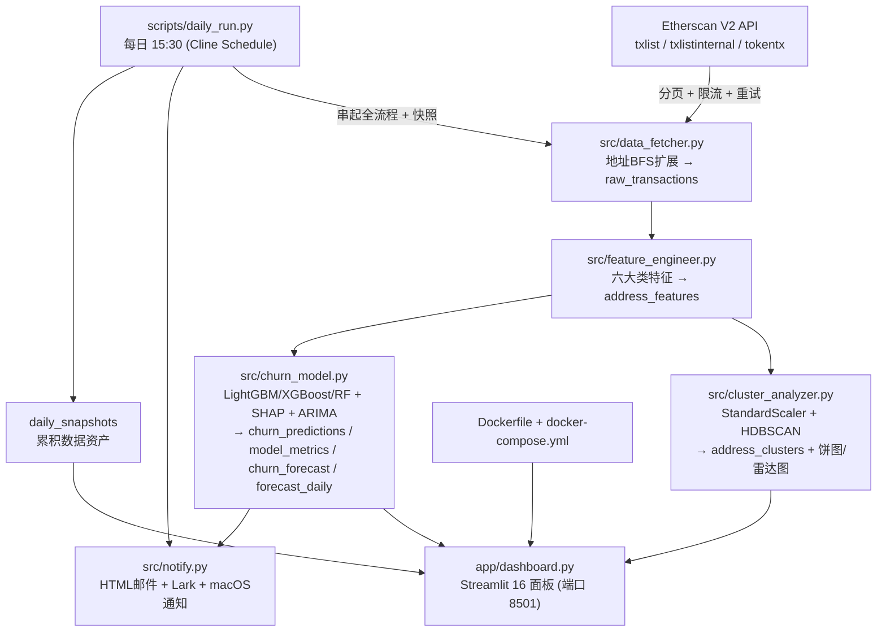

# 🪙 加密货币用户行为聚类分析与流失预测
### Crypto User Behaviour Clustering & Churn Prediction

[中文](#中文) | [English](#english)

一个**批量离线**的链上用户行为分析系统：从 Etherscan 拉取以太坊地址近 6 个月的交易，
做特征工程 → HDBSCAN 聚类画像 → LightGBM/XGBoost/RandomForest 流失预测 + SHAP 可解释性 +
ARIMA 频次预测 → Streamlit 16 面板看板，并支持**定时任务**与**邮件/Lark 预警**。

- **数据源**：Etherscan API V2（普通 / 内部 / ERC-20 三类交易）
- **存储**：SQLite（`data/crypto_churn[_test].db`）
- **聚类**：HDBSCAN（识别变密度簇 + 噪音点）
- **分类**：LightGBM（主）/ XGBoost / RandomForest 三者对比
- **可解释性**：SHAP（全局 + 单样本）
- **时间序列**：ARIMA（预测未来 30 天交易频次）
- **可视化**：Streamlit + Plotly（16 panels）
- **交付**：Docker 单镜像，`docker compose up` 一键跑全流程并开看板

---

## 🏗️ 架构图 (Mermaid)



**执行顺序**：`data_fetcher` → `feature_engineer` → `cluster_analyzer` → `churn_model` →
`streamlit run app/dashboard.py` → 浏览器打开 `http://localhost:8501`。

---

## 🧰 技术栈

`requests` · `pandas` · `numpy` · `scikit-learn` · `hdbscan` · `lightgbm` · `xgboost` ·
`shap` · `statsmodels`(ARIMA) · `plotly` · `streamlit` · `python-dotenv`

---

## 📁 目录结构

```
crypto_churn_prediction_project/
├── src/
│   ├── config.py            # 集中配置 + 测试模式后缀逻辑
│   ├── db.py                # SQLite schema + 连接
│   ├── data_fetcher.py      # ① 抓取
│   ├── feature_engineer.py  # ② 特征
│   ├── cluster_analyzer.py  # ③ 聚类
│   ├── churn_model.py       # ④ 流失预测 + SHAP + ARIMA + 三模型对比
│   └── notify.py            # 邮件 / Lark / macOS 告警
├── app/dashboard.py         # ⑤ Streamlit 16 面板
├── scripts/
│   ├── run_pipeline.py      # 一键串起 ①→④
│   └── daily_run.py         # 每日 15:30 调度 + 快照 + 告警
├── templates/alert_email.html  # 预警邮件 HTML（{{占位符}}）
├── docs/
│   ├── development-log.md   # 技术决策 + 踩坑
│   └── insights.md          # 业务洞察（自动生成）
├── tests/test_pipeline.py   # 单元测试（无网络）
├── Dockerfile / docker-compose.yml / docker-entrypoint.sh / start.sh
├── environment.env.example / requirements.txt
└── README.md
```

---

## 🚀 本地部署和运行（三种方式）

### 方式 A：直接拉取镜像（最省事，不想 build）

```bash
# 拉取已构建好的镜像
docker pull bonnie333333333/crypto-churn-prediction:latest

# 一键跑全流程并启动看板（挂载宿主 ./data 持久化数据库）
docker run -d --name crypto-churn-app -p 8501:8501 \
  -e ETHERSCAN_API_KEY=你的Key \
  -e ADDRESS_LIMIT=200 \
  -v "$PWD/data:/app/data:rw" \
  bonnie333333333/crypto-churn-prediction:latest

# 打开 http://localhost:8501
```

### 方式 B：`docker compose up` 一句命令拉起（推荐，自动跑脚本 + 自动开网页）

```bash
# 1) 准备环境变量
cp environment.env.example environment.env
#    编辑 environment.env：填入 ETHERSCAN_API_KEY（可选 ADDRESS_LIMIT / 邮件 / Lark）

# 2) 一键：构建镜像 -> 首启自动跑完整流水线 -> 启动看板 -> 自动打开浏览器
./start.sh
#    等价于： docker compose up -d --build  然后  open http://localhost:8501
```

`docker-entrypoint.sh` 会在**首次启动**时自动按顺序执行：
`data_fetcher → feature_engineer → cluster_analyzer → churn_model → streamlit run app/dashboard.py`，
跑完整合到容器内数据库。之后重启会直接启动看板（用 marker 判断，`FORCE_PIPELINE=1` 可强制重跑）。

> 浏览器：打开 <http://localhost:8501> 即直接看到看板（Streamlit 无需登录）。

### 方式 C：手动一步步依次跑脚本（本地 conda，便于调试）

```bash
# 0) 激活环境 + 安装依赖
conda activate crypto_churn_prediction_project      # Python 3.11
# 没有就先： conda create -n crypto_churn_prediction_project python=3.11 -y
pip install -r requirements.txt

# 1) 配置密钥
cp environment.env.example environment.env           # 填入 ETHERSCAN_API_KEY

# 2) 按顺序执行（测试用 ADDRESS_LIMIT=200，产物带 _test 后缀；全量改 2000）
python src/data_fetcher.py           # 抓取 → raw_transactions
python src/feature_engineer.py       # 特征 → address_features
python src/cluster_analyzer.py       # 聚类 → address_clusters + 图表
python src/churn_model.py            # 预测 → churn_predictions / model_metrics / churn_forecast
streamlit run app/dashboard.py       # 看板 → http://localhost:8501
```

也可以用一键脚本（等价于上面 ①→④）：

```bash
python scripts/run_pipeline.py          # 全流程（含抓取）
python scripts/run_pipeline.py --skip-fetch   # 复用已有原始数据
python scripts/daily_run.py --dry-run   # 模拟每日任务（不联网抓取）
```

> **测试模式说明**：`ADDRESS_LIMIT<=200` 时判定为测试模式，所有产物文件名自动加 `_test`
> 后缀（如 `data/crypto_churn_test.db`、`reports/cluster_pie_test.png`），避免污染全量数据集。
> 确认全流程跑通后，把 `environment.env` 里的 `ADDRESS_LIMIT` 改为 `2000` 分批全量拉取。

---

## 🔍 各阶段说明

### ① 数据抓取 `src/data_fetcher.py`
从 10 个种子地址出发，**BFS 扩展交易对手方**直到凑够 `ADDRESS_LIMIT` 个地址；对每个地址拉取
普通/内部/ERC-20 三类交易，`INSERT OR IGNORE` 幂等入库，分页 + 限流 + 指数退避重试。

### ② 特征工程 `src/feature_engineer.py`（六大类特征）
交易频次（日/周/月）、平均持仓时长（收到→转出，FIFO 配对）、Gas 消耗模式（高 Gas 占比/均价）、
协议多样性（交互合约数）、代币行为（不同代币数/占比）、资产规模变化（ETH 余额趋势斜率）。

### ③ 聚类 `src/cluster_analyzer.py`
`StandardScaler` 标准化 → **HDBSCAN** 聚类 → 按质心自动打 persona 标签
（**高频大户 / 长期持有者 / DeFi农民 / 高频套利者**，噪音点单独标记）→ 输出簇分布饼图、
簇画像雷达图、t-SNE 坐标。

> **为何用 HDBSCAN 而非 K-Means**：链上数据密度极不均匀（少数超级大户 + 长尾静止地址），
> K-Means 假设球形等方差且强制每个点归簇；HDBSCAN 能识别变密度簇并把"机器人/一次性地址"
> 判为**噪音点**，簇更紧凑、可解释性更强。

### ④ 流失预测 `src/churn_model.py`
- **标签**：`last_tx_days_ago > 30` 记流失。
- **三模型对比**：LightGBM（主）/ XGBoost / RandomForest，输出 AUC / F1 / Precision / Recall，
  并在洞察中对比"三种针对离散标签的建模方式谁更科学"。
- **SHAP**：全局特征重要性 + **单样本解释**（如"协议多样性从 5 降到 1 → 流失概率上升 40%"）。
- **频次 × 流失率相关性**：按 `tx_freq_daily` 分桶统计真实流失率，定位**危险频次区间**。
- **ARIMA 预测**：对每个地址的日交易笔数序列拟合 `ARIMA(1,1,1)`，预测**未来 30 天频次**，
  统计**每天流失率**与**人均交易频次降低值**，并给出结论。

### ⑤ 可视化 `app/dashboard.py`（16 panels）
1 核心指标卡 · 2 簇分布饼图 · 3 簇画像雷达图 · 4 t-SNE 散点 · 5 模型指标表 · 6 三模型对比 ·
7 各簇流失率 · 8 流失概率分布 · 9 SHAP 全局 · 10 SHAP 单样本 · 11 频次×流失率 · 12 未来30天预测 ·
13 高危地址 TOP20 · 14 累积数据资产 · 15 管道运行健康 · 16 业务洞察文字区。

---

## ⏰ 每日调度与数据资产化

用 **Cline Schedule** 确保每天 **15:30** 自动运行、持续累积数据资产：

```bash
# 通过 Cline 创建一个每日 15:30 的定时任务（cron: 30 15 * * *）
# 任务内容示例：
cd ~/Desktop/crypto_churn_prediction_project && \
  conda run -n crypto_churn_prediction_project python scripts/daily_run.py
```

或系统 cron：

```bash
# 0 分 15 时（即 15:30... 见下方 30 15）—— 每天 15:30
30 15 * * * cd ~/Desktop/crypto_churn_prediction_project && \
  conda run -n crypto_churn_prediction_project python scripts/daily_run.py >> logs/cron.log 2>&1
```

`scripts/daily_run.py` 每次会：跑全流程 → 写入 `daily_snapshots`（看板第 14 个面板展示日累积曲线）
→ 生成 HTML 报告到 `reports/` → **成功或失败都弹 macOS 通知**（与 Whale 项目一致）→
按阈值决定是否发预警邮件/Lark。

---

## 🔔 预警邮件 + Lark 告警

当**预测流失率 ≥ 40%** 或**高危占比 ≥ 25%** 时自动触发：

- **邮件**：`templates/alert_email.html`（HTML 模板，预留 `{{churn_rate}}` / `{{freq_drop}}` 等
  占位符，按每次告警数值自动填空）→ 发送到 `ALERT_EMAIL_TO`。
- **Lark（飞书）**：群机器人 webhook + `@` 指定手机号 `LARK_AT_PHONE`。
- **macOS**：系统通知横幅。

在 `environment.env` 中配置：

```env
SMTP_HOST=smtp.gmail.com
SMTP_PORT=465
SMTP_USER=dingbangchu@gmail.com
SMTP_PASS=你的Gmail应用专用密码
ALERT_EMAIL_TO=dingbangchu@gmail.com
LARK_WEBHOOK_URL=https://open.feishu.cn/open-apis/bot/v2/hook/xxxx
LARK_AT_PHONE=13339947334
ALERT_CHURN_RATE_THRESHOLD=0.40
ALERT_RISK_CLUSTER_RATIO=0.25
```

手动测试告警渲染与发送：

```bash
python -m src.notify     # 用示例数值发一封测试邮件/Lark
```


---

## 🐳 Docker 封装与推送（维护者）

```bash
# 构建镜像
docker build -t bonnie333333333/crypto-churn-prediction:latest .

# 本地冒烟测试
docker run --rm -p 8501:8501 -v "$PWD/data:/app/data:rw" \
  bonnie333333333/crypto-churn-prediction:latest

# 推送到 Docker Hub（需先 docker login）
docker push bonnie333333333/crypto-churn-prediction:latest
```

`docker-compose.yml` 关键点：Streamlit 端口 **8501**；`env_file` 读取
`environment.env`（可选，未提供也能启动）；挂载 `./data` 与 `./reports` 持久化；
`healthcheck` 探测 `/_stcore/health`。

> **构建小贴士（Apple Silicon / linux-arm64）**：镜像基于 `python:3.11-slim`，
> 由于 arm64 上没有 `hdbscan` 预编译 wheel，Dockerfile 里预装了 `gcc g++ python3-dev cython3`
> 用于源码编译；`xgboost` 固定为 `2.1.4`（`3.x` 会在 Linux 上拉取数百 MB 的 CUDA 依赖，
> 即使只用 CPU，会让镜像膨胀）。首次 `docker build` 约需几分钟。

---

## ✨ 未来可优化点

1. **多链支持**：扩展 `chainid` 到 Polygon / Arbitrum / BSC，横向对比用户行为。
2. **图神经网络 (GNN)**：把地址-交易构图，用 GraphSAGE/GCN 学习结构特征，补充表格特征。
3. **增量特征**：每日只增量更新频次/余额类特征，避免全量重算。
4. **更好的时序模型**：用 Prophet / N-BEATS / Temporal Fusion Transformer 替代 ARIMA 提升长程预测。
5. **聚类自动命名**：用 LLM 对簇质心生成自然语言画像，替代规则打分。
6. **模型监控**：记录每次训练的 AUC 漂移与特征分布，触发再训练。
7. **成本优化**：对高频地址做请求缓存、批量 RPC，降低 Etherscan 配额消耗。
8. **实时化**：结合 Whale 项目的准实时管道，把"离线建模"与"在线打分"打通。

---

<details>
<summary>🧑‍💼 给业务同学的大白话解释（点开）</summary>

把每个以太坊地址想成一位**用户**。我们去看他们过去半年在网上"做了什么、做了多少、跟谁玩"，
然后回答三个问题：

1. **他们是谁？**（聚类）——我们把用户分成几类：**高频大户**（钱多、出手频繁）、
   **长期持有者**（买进来就放着不动）、**DeFi 农民**（到处薅利息、玩各种协议）、
   **高频套利者**（快进快出赚差价），还有一类**机器人/一次性地址**（像脚本刷量，我们单独标出来）。

2. **谁要走了？**（流失预测）——如果一个地址**超过 30 天没有任何动作**，我们就认为它"流失"了。
   我们用模型提前预测"谁在接下来 30 天可能会流失"，并用 **SHAP** 解释原因，比如
   "这个地址以前玩 5 个协议，现在只剩 1 个，它流失的概率就上去了"。

3. **会走多少？**（趋势预测）——用时间序列模型预测未来 30 天大家**每天还会交易多少次**，
   预计**每天的流失比例**，帮我们提前决定要不要做活动挽回。

一句话：**这是一个"链上用户体检 + 流失预警"系统，看板就是体检报告，邮件/Lark 就是报警器。**

</details>

---

## 🆚 本项目与 Whale 监控项目的差异点

| 维度 | 🐋 Whale-alert-system（参考项目） | 🪙 本项目 |
| --- | --- | --- |
| 目标 | 实时发现大额 ETH 转账并预警 | 对地址做行为画像 + 流失预测 |
| 数据模式 | **实时流式**（轮询新块） | **批量离线**（近 6 个月快照） |
| 核心方法 | **规则引擎**（金额 > 阈值即巨鲸） | **无监督聚类 + 监督分类 + SHAP 可解释性** |
| 建模 | 无机器学习 | HDBSCAN + LightGBM/XGBoost/RF + SHAP + ARIMA |
| 可视化 | **Grafana**（SQLite 插件，面板 SQL） | **Streamlit + Plotly**（16 交互面板） |
| 存储 | SQLite（`whale_transfers` 等） | SQLite（`raw_transactions` / `address_features` / `address_clusters` / `churn_*` …） |
| 告警 | 终端打印 + macOS 通知 | **HTML 邮件 + Lark 飞书 + macOS 通知**（带阈值判断） |
| 调度 | 每日扫描新块 | 每日 15:30 全流程 + 数据资产快照累积 |
| 交付 | Docker Compose（checker + Grafana） | 单镜像（流水线 + Streamlit），`start.sh` 自动开网页 |
| 端口 | 3000 / 3001 | 8501 |

---

## 📚 文档索引

- [docs/development-log.md](docs/development-log.md) —— 技术决策思考 + 踩坑记录
- [docs/insights.md](docs/insights.md) —— 业务洞察（运行后自动生成）
- [environment.env.example](environment.env.example) —— 环境变量模板

---

## 🇬🇧 English (Summary)

**Batch off-chain analytics for Ethereum users**: fetch ~6 months of normal / internal /
ERC-20 transactions for 200 (test) or 2000 (full) addresses from Etherscan V2, engineer six
behavioural feature families, cluster with **HDBSCAN** (personas: High-frequency Whale,
Long-term Holder, DeFi Farmer, High-frequency Arbitrageur, plus Noise/bots), predict churn
(`last_tx_days_ago > 30`) with **LightGBM / XGBoost / RandomForest** (compared), explain it
with **SHAP**, and forecast each address's next-30-day transaction frequency with **ARIMA**
(plus daily churn rate and average frequency drop). A **Streamlit** dashboard (16 panels)
visualises everything on port **8501**; a daily 15:30 schedule accumulates a data asset and
sends **HTML e-mail + Lark** alerts when thresholds are crossed.

**Run it in three ways**: `docker pull` the image · `./start.sh` (one-command compose up +
auto-opens the browser) · or run `data_fetcher → feature_engineer → cluster_analyzer →
churn_model → streamlit run app/dashboard.py` manually in the
`crypto_churn_prediction_project` conda env (Python 3.11).

Key design note: **HDBSCAN over K-Means** because on-chain behaviour is variable-density and
contains outliers (bots / one-off addresses) that K-Means would force into arbitrary clusters.

