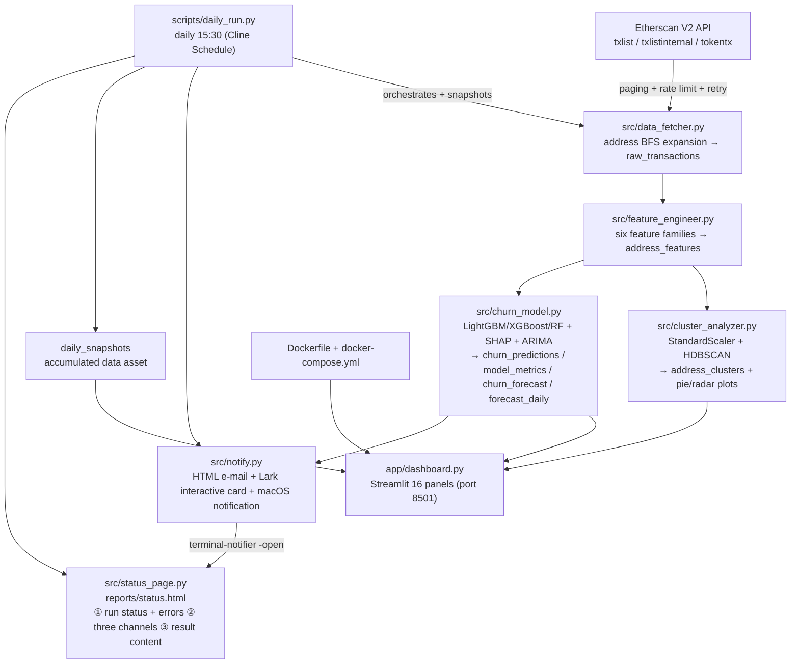

# 🪙 Crypto User Behaviour Clustering & Churn Prediction
### Batch on-chain user analytics for Ethereum

[中文](README.md) | [English](README_en.md)

A **batch, offline** on-chain user-analysis system: it pulls ~6 months of Ethereum address
activity from Etherscan, runs feature engineering → **HDBSCAN** clustering (behavioural
personas) → churn prediction with **LightGBM / XGBoost / RandomForest** + **SHAP**
explainability + **multi-horizon ARIMA** frequency forecasting → a **16-panel Streamlit**
dashboard, and supports **scheduled runs** with **e-mail / Lark / macOS** alerting.

Every run produces four "you can see the result" outputs, and **all four carry the same
content**: **run status + error details · risk level (are we in danger?) · multi-horizon
churn rates · cluster personas · business insights · suggested next actions.**

- **Data source**: Etherscan API V2 (normal / internal / ERC-20 transactions)
- **Storage**: SQLite (`data/crypto_churn[_test].db`)
- **Clustering**: HDBSCAN (variable-density clusters + noise points)
- **Classification**: LightGBM (primary) / XGBoost / RandomForest, compared side by side
- **Explainability**: SHAP (global + single-sample)
- **Time series**: ARIMA — **one fit emits 1 / 7 / 14 / 30 / 90-day** frequency and churn forecasts
- **Visualisation**: Streamlit + Plotly (16 panels)
- **Pushing**: HTML e-mail · **Lark interactive card (real bold + coloured header)** ·
  macOS notification (**click opens the run-status page**)
- **Run-status page**: `reports/status.html` (three channels + result content + error details,
  just double-click it locally)
- **Delivery**: a single Docker image; `docker compose up` runs the whole pipeline and opens the dashboard

> ⚠️ **Sample size (important)**: the real 24h-active node set is ~**12000** addresses and it is
> **not runnable on a laptop** (a free Etherscan key allows ≈5 requests/second; even 2000
> addresses take hours). This project therefore takes **2000 addresses as a "link-validation
> run"**: it proves that fetch → features → clustering → three-model prediction → multi-window
> ARIMA → e-mail/Lark/dashboard can run **end to end**. Once an internal Etherscan API (or a
> self-hosted archive node) is available, set `ADDRESS_LIMIT=12000` and widen `MONTHS_BACK` —
> **the code path is identical**.

---

## 🏗️ Architecture (Mermaid)



**Execution order**: `data_fetcher` → `feature_engineer` → `cluster_analyzer` → `churn_model`
→ `streamlit run app/dashboard.py` → open `http://localhost:8501`.

---

## 🧰 Tech stack

`requests` · `pandas` · `numpy` · `scikit-learn` · `hdbscan` · `lightgbm` · `xgboost` ·
`shap` · `statsmodels` (ARIMA) · `plotly` · `streamlit` · `python-dotenv`

---

## 📁 Directory structure

```
crypto_churn_prediction_project/
├── src/
│   ├── config.py            # central config + test-mode suffix logic
│   ├── db.py                # SQLite schema + connection
│   ├── data_fetcher.py      # ① fetch
│   ├── feature_engineer.py  # ② features
│   ├── cluster_analyzer.py  # ③ clustering
│   ├── churn_model.py       # ④ churn + SHAP + ARIMA (1/7/14/30/90-day windows)
│   ├── notify.py            # e-mail / Lark card / macOS alert + digest & suggestions
│   └── status_page.py       # run-status page reports/status.html (opened by notifications)
├── app/dashboard.py         # ⑤ Streamlit, 16 panels
├── scripts/
│   ├── run_pipeline.py      # runs ①→④ in one go
│   └── daily_run.py         # daily 15:30 schedule + snapshot + alerts + status page
├── templates/alert_email.html  # alert e-mail HTML ({{placeholders}})
├── reports/                 # artefacts: charts / HTML report / status.html / email_preview.html / lark_card.json
├── docs/
│   ├── development-log.md   # design decisions + pitfalls
│   └── insights.md          # business insights (auto-generated)
├── tests/test_pipeline.py   # unit tests (no network)
├── Dockerfile / docker-compose.yml / docker-entrypoint.sh / start.sh
├── environment.env.example / requirements.txt
└── README.md / README_en.md
```

---

## 🚀 Running it (three ways)

### Option A: pull the image (least effort, no build)

```bash
# pull the pre-built image
docker pull bonnie333333333/crypto-churn-prediction:latest

# run the whole pipeline and start the dashboard (bind-mount ./data to persist SQLite)
docker run -d --name crypto-churn-app -p 8501:8501 \
  -e ETHERSCAN_API_KEY=YOUR_KEY \
  -e ADDRESS_LIMIT=200 \
  -v "$PWD/data:/app/data:rw" \
  bonnie333333333/crypto-churn-prediction:latest

# open http://localhost:8501
```

### Option B: `docker compose up` in one command (recommended)

```bash
# 1) prepare env vars
cp environment.env.example environment.env
#    edit environment.env: set ETHERSCAN_API_KEY (optionally ADDRESS_LIMIT / e-mail / Lark)

# 2) one shot: build → first boot runs the full pipeline → start dashboard → open browser
./start.sh
#    equivalent to: docker compose up -d --build  then  open http://localhost:8501
```

On **first boot** `docker-entrypoint.sh` runs, in order:
`data_fetcher → feature_engineer → cluster_analyzer → churn_model → streamlit run app/dashboard.py`
and persists everything into the in-container database. Later restarts go straight to the
dashboard (a marker file decides; set `FORCE_PIPELINE=1` to force a re-run).

### Option C: run the scripts step by step (local conda, easiest to debug)

```bash
# 0) activate the env + install dependencies
conda activate crypto_churn_prediction_project      # Python 3.11
# if missing: conda create -n crypto_churn_prediction_project python=3.11 -y
pip install -r requirements.txt

# 1) configure the key
cp environment.env.example environment.env           # fill in ETHERSCAN_API_KEY

# 2) run in order (test = ADDRESS_LIMIT 200 with a _test suffix; local run = 2000)
python src/data_fetcher.py           # fetch   → raw_transactions
python src/feature_engineer.py       # features→ address_features
python src/cluster_analyzer.py       # cluster → address_clusters + charts
python src/churn_model.py            # predict → churn_predictions / model_metrics / churn_forecast
streamlit run app/dashboard.py       # dashboard → http://localhost:8501
```

One-shot helpers:

```bash
python scripts/run_pipeline.py          # full pipeline (including fetch)
python scripts/run_pipeline.py --skip-fetch   # reuse the raw data already in SQLite
python scripts/daily_run.py --dry-run   # simulate the daily job (no network fetch)
```

> **Test mode**: when `ADDRESS_LIMIT<=200` every artefact gets a `_test` suffix
> (`data/crypto_churn_test.db`, `reports/cluster_pie_test.png`, …) so the full dataset is never
> polluted. The local feasibility run uses `2000` (several hours under the free Etherscan rate
> limit); the **full ~12000-node run** needs the internal Etherscan API / an archive node —
> just set `ADDRESS_LIMIT=12000`.

---

## 🔍 Stage by stage

### ① Fetching — `src/data_fetcher.py`
Starts from 10 seed addresses and **expands through counterparties (BFS)** until
`ADDRESS_LIMIT` addresses are collected; for each address it pulls normal / internal / ERC-20
transactions, writes idempotently with `INSERT OR IGNORE`, and handles paging + rate limits +
exponential-backoff retries.

### ② Feature engineering — `src/feature_engineer.py` (six families)
Transaction frequency (daily/weekly/monthly), average holding time (received→sent, FIFO
pairing), gas-consumption pattern (high-gas share / average price), protocol diversity
(number of interacted contracts), token behaviour (distinct tokens / share), asset-size trend
(slope of the ETH balance).

### ③ Clustering — `src/cluster_analyzer.py`
`StandardScaler` → **HDBSCAN** → centroids auto-labelled into personas
(**High-frequency Whale / Long-term Holder / DeFi Farmer / High-frequency Arbitrageur**, with
noise flagged separately) → cluster pie chart, persona radar chart, t-SNE coordinates.

> **Why HDBSCAN instead of K-Means**: on-chain density is extremely uneven (a few super-whales
> plus a long tail of dormant addresses). K-Means assumes spherical equal-variance clusters and
> forces every point into a cluster; HDBSCAN finds variable-density clusters and marks
> "bots / one-off addresses" as **noise**, which yields tighter and more interpretable clusters.

### ④ Churn prediction — `src/churn_model.py`
- **Label**: `last_tx_days_ago > 30` counts as churned.
- **Three-model comparison**: LightGBM (primary) / XGBoost / RandomForest with
  AUC / F1 / Precision / Recall, plus an insight comparing which modelling approach is more
  sound for a discrete label.
- **SHAP**: global feature importance + **single-sample explanations** (e.g. "protocol
  diversity dropping from 5 to 1 raises churn probability by 40%").
- **Frequency × churn rate**: churn rate bucketed by `tx_freq_daily` to locate the **dangerous
  frequency band**.
- **ARIMA (multi-horizon)**: one `ARIMA(1,1,1)` fit per address, **fitted to the maximum window**
  (90 days by default), then **a single pass emits 1 / 7 / 14 / 30 / 90-day** windows with
  average daily frequency, frequency drop, average churn rate and final-day churn rate. This
  avoids the 5× cost of refitting per window and adds a **short-window vs long-window
  conclusion**: if the short window is already at/above the long window, addresses are
  "**fleeing fast**" and need immediate intervention; otherwise it is "gradual decay" and there
  is still time to win them back.

### ⑤ Visualisation — `app/dashboard.py` (16 panels)
1 KPI cards · 2 cluster pie · 3 persona radar · 4 t-SNE scatter · 5 model metrics · 6 three-model
comparison · 7 churn rate per cluster · 8 churn-probability distribution · 9 global SHAP ·
10 single-sample SHAP · 11 frequency × churn · 12 next-30-day forecast · 13 top-20 risky
addresses · 14 accumulated data asset · 15 pipeline health · 16 business insights text.


---

## ⏰ Daily scheduling & data-asset accumulation

Use a **Cline Schedule** to run every day at **15:30** and keep accumulating a data asset:

```bash
# create a daily 15:30 Cline task (cron: 30 15 * * *)
cd ~/Desktop/crypto_churn_prediction_project && \
  conda run -n crypto_churn_prediction_project python scripts/daily_run.py
```

Or system cron:

```bash
# minute 30, hour 15 — 15:30 every day
30 15 * * * cd ~/Desktop/crypto_churn_prediction_project && \
  conda run -n crypto_churn_prediction_project python scripts/daily_run.py >> logs/cron.log 2>&1
```

Each `scripts/daily_run.py` run: executes the whole pipeline → writes `daily_snapshots`
(the 14th dashboard panel plots the daily curve) → writes the HTML report into `reports/` →
builds the **run-status page `reports/status.html`** and **opens it in the browser** →
sends a **macOS notification** (success *and* failure; `terminal-notifier`, **clicking the
notification opens the status page**) → decides whether to send the alert e-mail / Lark card
based on thresholds → records the run in `reports/last_run.json`.

### 📄 Run-status page `reports/status.html`

Everything a single run has to deliver converges on this one page (double-click to open, no
server needed):

| Block | Content |
| --- | --- |
| Header | ✅/❌ run-status badge + 🟢🟡🟠🔴 risk level (× threshold multiple) + timestamp / duration / forecast window |
| 1. Run status + errors | Per-stage (① fetch / ② features / ③ clustering / ④ churn) ok/fail/detail/time; on failure the **raw error text** |
| 2. Three channels | 📧 e-mail (recipient + HTML preview link) · 💬 Lark (card JSON link) · 📊 Streamlit dashboard (clickable) |
| 3. Result content | Main-window churn rate · **1/7/14/30/90-day churn rates (⚠️ when over the line)** · high-risk share · frequency / drop · sample size |
| 4. Cluster results | Size / actual churn rate / daily tx / holding / idle per cluster (identical to the Lark card) |
| 5. Business insights | The whole `docs/insights.md` |
| 6. Suggested next actions | Template-generated actions + owning team (growth / risk / customer success …) |
| Appendix | Raw Lark text (collapsible) + sample-size note |

> **One-time setup (macOS, optional)**: for "click the notification to jump", allow
> `terminal-notifier` to post notifications: System Settings → Notifications →
> **Terminal Notifier** → allow. You can jump straight to that pane with
> `open "x-apple.systempreferences:com.apple.Notifications-Settings.extension"`.
> This project copies the app bundle to `~/Applications/Terminal Notifier.app` and registers it
> with LaunchServices (`lsregister -f`) — without that macOS only reports
> `Notifications are not allowed for this application` and never lists the app in Settings.
> If permission is missing the code **automatically falls back** to a plain `osascript`
> banner (logging the enable hint above), and the status page is still opened automatically,
> so no functionality is lost.


---

## 🔔 Alerting: e-mail + Lark card + macOS notification + run-status page

Four outputs, built and dispatched by `src/notify.py` + `src/status_page.py` from **one shared
source of truth**:

| Output | Content | Trigger |
| --- | --- | --- |
| **E-mail** | HTML card (`templates/alert_email.html`, placeholder-filled): **run status + risk level + multi-horizon + core metrics + trigger reasons + suggested actions** → `ALERT_EMAIL_TO` | predicted churn rate ≥ 40 % **or** high-risk share ≥ 25 % |
| **Lark / Feishu bot** | **Interactive card** (`msg_type: interactive` + `lark_md`) = ① **run status + errors** ② **risk level (🟢🟡🟠🔴 + × threshold + action)** ③ **1/7/14/30/90-day churn rates (⚠️ over the line)** ④ "1. churn warning" ⑤ "2. text-form cluster personas" ⑥ "3. auto-distilled insights" ⑦ **suggested next actions with owning teams** ⑧ dashboard link. Header colour follows status/risk (run failure or 🔴 = red) | **pushed daily**, not gated by thresholds; the warning block is marked ⚠️ when triggered |
| **macOS notification** | `terminal-notifier` banner (title = ✅/❌ + churn rate + risk level), **clicking opens `reports/status.html`** | always, success and failure |
| **Run-status page** | `reports/status.html`: ① run status + errors ② three channels ③ result content ④ clusters ⑤ insights ⑥ suggestions | generated and auto-opened on every run |

> **"Is Lark limited to plain text?"** No. The group-bot webhook supports
> `msg_type: "interactive"` (message cards); text inside the card uses the `lark_md` dialect, so
> you get **real bold**, a coloured header bar, dividers, hyperlinks and @-mentions.
> `msg_type: "post"` (rich text) can also bold but has no coloured header — hence the digest uses
> a **card** while keeping a **plain-text fallback** (automatic downgrade if the card fails, see
> `send_lark_digest()`).

The card is built by `build_digest_card()`, the plain text by `build_digest_text()`. Real sample
(`python -m src.notify --preview` or `python -m src.notify`) — the production copy is in Chinese
because the audience is Chinese-speaking; the *structure* is what matters:

```text
📮 加密用户行为聚类 & 流失预测 · 每日简报
2026-10-06 21:45 ｜ 预测时间窗 30 天 ｜ 风险等级 🟠 警戒
————————————
运行状态：✅ 成功（4/4 阶段成功）
完成时间：2026-10-06 21:44 ｜ 耗时 3421 秒
① 数据抓取：ok ｜ 2000 个地址 / 1873921 条交易
② 特征工程：ok ｜ 2000 行特征
③ 聚类：ok ｜ 4 类 + 137 个噪音点
④ 流失预测：ok ｜ 主模型 LightGBM · AUC 0.91

报错内容：无
————————————
🟠 警戒 ｜ 已越过预警线（1.17× 阈值 40%）→ 进入处置流程：高危簇触达 + 召回实验
多时间窗流失率预测（越线标 ⚠️，阈值 40%）
- 1 天：流失率 58.2% ⚠️ ｜ 人均日频 1.42（较当前降 2.21）
- 7 天：流失率 55.1% ⚠️ ｜ 人均日频 1.55（较当前降 2.08）
- 30 天：流失率 51.5% ⚠️ ｜ 人均日频 1.86（较当前降 1.77）
- 90 天：流失率 49.0% ⚠️ ｜ 人均日频 2.05（较当前降 1.58）
- 结论：短窗（1 天）流失率已不低于长窗，说明正在加速出逃，需立刻干预。
————————————
一、流失预警（已触发 ⚠️）
预测流失率（30 天）: 51.5%（阈值 40%）
高危流失占比: 67.0%（阈值 25%）　高危行为簇占比: 52.0%
人均日交易频次: 33.8058 → 第 30 天 19.2369（降幅 14.526）
触发原因: 预测 30 天流失率 51.5% ≥ 阈值 40%；高危地址占比 67.0% ≥ 阈值 25%
————————————
二、【用户行为聚类结果】HDBSCAN · 4 类 + 96 个噪音点 · 覆盖 200 个地址
⚠️ 噪音/机器人 · 96 个（48.0%）｜实际流失率 38.5% · 日均 67.10 笔 · …
高频大户 · 55 个（27.5%）｜实际流失率 74.5% · 日均 4.23 笔 · 持仓 8.4h · …
    └ 交易频繁、余额厚，是协议的核心用户
长期持有者 · 31 个（15.5%）｜实际流失率 12.9% · …
    └ 低频但持仓久，粘性最强、流失率最低
————————————
三、业务洞察（从聚类与模型自动提炼）
· 驱动流失的关键特征 (SHAP)
• total_tx: 平均 |SHAP| = 1.1441
· 结论
未来 30 天人均交易频次预计由 33.8058 降至 19.2369 …
————————————
初步推进建议（模板规则生成，非大模型）
- 立刻止血：短窗流失率已高于长窗，属于加速出逃，建议 48h 内上线一轮定向召回（责任方：增长/运营 + 客户成功 ｜ 依据：多时间窗对比）
- 主攻「高频套利者」（55 个 · 占 27.5%）：定向召回 + 费率/返佣实验（责任方：增长 / 运营 ｜ 依据：高频 Gas 占比高、长期闲置，对收益率与费率极敏感）
- 守住基本盘：「长期持有者」实际流失率最高（12.9%），长期激励 / 治理参与提粘性（责任方：产品 ｜ 依据：持仓久、流失率最低）
- 升级报备：当前 🟠 警戒（1.17× 阈值）→ 进入处置流程：高危簇触达 + 召回实验；建议 24h 内拉齐 增长/产品/风控/数据 开 30 分钟对齐会（责任方：业务负责人 + 数据 ｜ 依据：风险等级）
- 扩样本 + 拉长时间窗：本轮 2000 个地址是链路可行性验证（全量约 12000 个节点，本机跑不动）→ 申请公司内部 Etherscan API / 归档节点（责任方：数据/平台工程）
————————————
看板: http://localhost:8501
```

**"Suggested next actions" is generated by pure template rules** (`build_suggestions()`: it
assembles actions + owning teams from the run status / risk level / multi-window trend /
high-risk clusters / data coverage) with **no LLM call at all** — stable, auditable, zero token
cost every day. See [Next-step optimizations](#-next-step-optimizations) for the LLM-based path.


Configure it in `environment.env`:

```env
# —— Lark (works immediately once filled in) ——
LARK_WEBHOOK_URL=https://open.larksuite.com/open-apis/bot/v2/hook/xxxx
# @-mentions only accept a Lark open_id (starting with ou_); phone numbers are ignored
LARK_AT_ID=ou_xxxxxxxxxxxxxxxx

# —— E-mail plan A (recommended): Gmail API + OAuth2 ——
GMAIL_CLIENT_ID=xxxx.apps.googleusercontent.com
GMAIL_CLIENT_SECRET=xxxx
GMAIL_REFRESH_TOKEN=        # produced by: python -m src.notify --oauth-login

# —— E-mail plan B: SMTP + app password (only if the account still allows it) ——
SMTP_HOST=smtp.gmail.com
SMTP_PORT=465
SMTP_USER=you@gmail.com
SMTP_PASS=your_gmail_app_password
ALERT_EMAIL_TO=you@gmail.com

# Outbound proxy (shared by e-mail / Google API): Google domains are often
# TLS-filtered in CN networks, so point this at a local proxy.
NET_PROXY=http://127.0.0.1:7897
SMTP_PROXY=http://127.0.0.1:7897

ALERT_CHURN_RATE_THRESHOLD=0.40
ALERT_RISK_CLUSTER_RATIO=0.25

# —— Multi-horizon forecast + risk levels (drives "are we in danger?") ——
FORECAST_HORIZON_DAYS=30          # main window (charts / thresholds / forecast_daily)
FORECAST_HORIZONS=1,7,14,30,90    # windows emitted by a single ARIMA fit
RISK_CRITICAL_MULTIPLIER=1.5      # ≥1.5× threshold → 🔴 critical (act now)
RISK_ALERT_MULTIPLIER=1.0         # ≥1.0× threshold → 🟠 alert
RISK_WATCH_MULTIPLIER=0.75        # ≥0.75× threshold → 🟡 watch, else 🟢 normal

# —— Links / entry points ——
DASHBOARD_URL=http://localhost:8501
ETHERSCAN_BASE_URL=https://api.etherscan.io/v2/api
GMAIL_API_SEND_URL=https://gmail.googleapis.com/gmail/v1/users/me/messages/send
```

> ⚠️ **Four pitfalls we actually hit** (see [docs/development-log.md](docs/development-log.md)):
> 1. **Google is retiring "app passwords"** (<https://myaccount.google.com/apppasswords>), which
>    is why this project supports **Gmail API + OAuth2** (port 443, easier to get through than
>    SMTP:465). Note: a Google Cloud **API key (`AIza...`) cannot send mail** — it only
>    identifies the project, not a user. Sending needs an **OAuth client ID + secret** (type:
>    Desktop app) plus a refresh token from a one-off consent:
>    `python -m src.notify --oauth-login` walks you through it.
> 2. Using the account password for `SMTP_PASS` yields `535 BadCredentials`, and Gmail drops the
>    connection right after the first rejection.
> 3. In CN networks `smtp.gmail.com` often **connects at TCP level but hangs on the TLS
>    handshake** (`openssl s_client` shows no response) — set `NET_PROXY` / `SMTP_PROXY`
>    (e.g. Clash's `http://127.0.0.1:7897`) to tunnel through the proxy.
> 4. `smtplib` **automatically retries with LOGIN after AUTH PLAIN fails**, masking the real
>    `535` as "Connection unexpectedly closed"; this project pins `AUTH PLAIN` so errors stay
>    readable.

Manual verification of the four outputs (uses the latest real results, no network send):

```bash
python -m src.notify --preview   # render only: reports/email_preview.html + reports/lark_card.json + print digest
python -m src.notify             # real send: e-mail + Lark card (needs OAuth / webhook)
python -m src.status_page        # build reports/status.html and print its path
python -m src.notify --oauth-login   # one-off Google consent, prints GMAIL_REFRESH_TOKEN
```

---

## 🐳 Docker packaging & pushing (maintainers)

```bash
# build
docker build -t bonnie333333333/crypto-churn-prediction:latest .

# local smoke test
docker run --rm -p 8501:8501 -v "$PWD/data:/app/data:rw" \
  bonnie333333333/crypto-churn-prediction:latest

# push to Docker Hub (docker login first)
docker push bonnie333333333/crypto-churn-prediction:latest
```

Key points in `docker-compose.yml`: Streamlit on port **8501**; `env_file` reads
`environment.env` (optional — it still starts without one); `./data` and `./reports` are
bind-mounted for persistence; a `healthcheck` probes `/_stcore/health`.

> **Build tips (Apple Silicon / linux-arm64)**: the image is based on `python:3.11-slim`; since
> arm64 has no pre-built `hdbscan` wheel, the Dockerfile pre-installs
> `gcc g++ python3-dev cython3` for a source build; `xgboost` is pinned to `2.1.4` (3.x pulls
> hundreds of MB of CUDA dependencies on Linux even for CPU-only use, bloating the image).
> The first `docker build` takes a few minutes.


---

## ✨ Future improvements

1. **Multi-chain**: extend `chainid` to Polygon / Arbitrum / BSC and compare behaviour across chains.
2. **Graph neural networks (GNN)**: build an address–transaction graph and learn structural features with GraphSAGE/GCN to complement the tabular ones.
3. **Incremental features**: update only frequency/balance-style features daily instead of recomputing everything.
4. **Better time-series models**: Prophet / N-BEATS / Temporal Fusion Transformer in place of ARIMA for long-range forecasts.
5. **Automatic cluster naming**: use an LLM on cluster centroids to produce natural-language personas instead of rule-based scoring.
6. **Model monitoring**: record AUC drift and feature distributions per training run and trigger retraining.
7. **Cost optimisation**: cache requests and batch RPC calls for high-frequency addresses to reduce Etherscan quota usage.
8. **Real-time**: connect the offline modelling with the near-real-time pipeline from the Whale project for online scoring.

---

## 🔜 Next-step optimizations

> These are **explicitly not done yet** — listed so they are not mistaken for finished work.

| Area | Current state | Next step |
| --- | --- | --- |
| **LLM-generated "suggested next actions"** | Currently **template rules** (`build_suggestions()`), zero cost, auditable | Assemble "run status + 1/7/14/30/90-day forecasts + cluster personas + top SHAP features" into structured context and hand it to an **internal LLM gateway (OEM / LOOM)** or a local Qwen/DeepSeek to produce more business-specific actions; keep the template output as **fallback** and as a baseline so hallucinations never reach the business group directly. A switch is already anticipated via an environment variable (`template / llm / both`) |
| **Full 12000 nodes** | This machine runs only **2000 addresses** as a link-validation run (free Etherscan key, 2000 ≈ hours) | Plug into the **internal Etherscan API / self-hosted archive node**: `ADDRESS_LIMIT=12000`, `MONTHS_BACK=6` — same code path. Then consider stratified sampling per cluster to control compute |
| **Image distribution** | `bonnie333333333/crypto-churn-prediction:latest` (1.63 GB) **pushed successfully**: `digest sha256:8f1eed0b4b6b90402d5b9412e13ef625199e1d756f6571c4274875c26b84fd8d`, within a **hard 5-minute cap** (`timeout 300 docker push`, abandon on timeout) | Uploads timed out repeatedly on restricted networks → now a hard cap + layer resumption; pushing to an internal registry (Harbor) is even more reliable |
| **Multi-chain / GNN / incremental features** | Not done | See items 1–8 in "Future improvements" above |

---

## 🆚 How this differs from the Whale monitoring project

| Dimension | 🐋 Whale-alert-system (reference) | 🪙 This project |
| --- | --- | --- |
| Goal | Detect large ETH transfers in real time and alert | Profile address behaviour + predict churn |
| Data mode | **Real-time streaming** (poll new blocks) | **Batch offline** (~6-month snapshot) |
| Core method | **Rule engine** (amount > threshold ⇒ whale) | **Unsupervised clustering + supervised classification + SHAP** |
| Modelling | No ML | HDBSCAN + LightGBM/XGBoost/RF + SHAP + ARIMA |
| Visualisation | **Grafana** (SQLite plugin, panel SQL) | **Streamlit + Plotly** (16 interactive panels) |
| Storage | SQLite (`whale_transfers`, …) | SQLite (`raw_transactions` / `address_features` / `address_clusters` / `churn_*`, …) |
| Alerting | Terminal output + macOS notification | **HTML e-mail + Lark interactive card + macOS notification (click opens the status page)** with threshold/risk logic |
| Scheduling | Scan new blocks daily | Daily 15:30 full pipeline + data-asset snapshots |
| Delivery | Docker Compose (checker + Grafana) | Single image (pipeline + Streamlit), `start.sh` opens the browser |
| Port | 3000 / 3001 | 8501 |

---

## 📄 Documentation

- [docs/development-log.md](docs/development-log.md) — design decisions + pitfalls
- [docs/insights.md](docs/insights.md) — business insights (auto-generated on each run)
- [environment.env.example](environment.env.example) — environment-variable template
- [README.md](README.md) — **中文 README**

